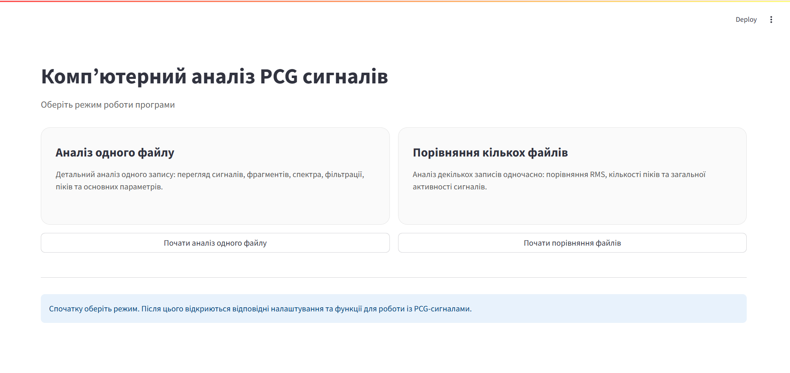
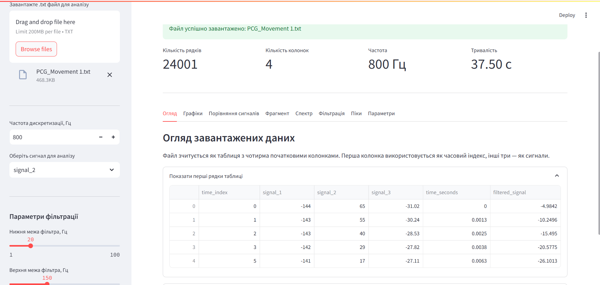
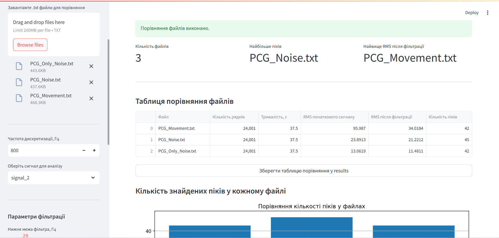

# Комп’ютерний аналіз PCG сигналів

Програмний застосунок розроблено для комп’ютерного аналізу PCG-сигналів (фонокардіограм).  
Програма дозволяє завантажувати записи біомедичних сигналів, виконувати їх візуалізацію, фільтрацію, спектральний аналіз, пошук піків та порівняння декількох файлів між собою.

## Автор

* ПІБ: Кіселичник Юлія Романівна
* Група: ФЕІ-41
* Освітній рівень: бакалавр
* Керівник: Паранчук Роман Ярославович
* Тема роботи: Комп’ютерний аналіз PCG сигналів
* Дата виконання: 26.05.2026


## Загальна інформація

- Тип проєкту: вебзастосунок для аналізу біомедичних сигналів
- Мова програмування: Python
- Основна бібліотека для інтерфейсу: Streamlit
- Основні бібліотеки для обробки даних: pandas, numpy, scipy, matplotlib
- Формат вхідних даних: `.txt`
- Частота дискретизації сигналів: 800 Гц

## Вхідні файли

Для тестування програми використовуються такі вхідні `.txt` файли:

- `PCG_Movement 1.txt` — запис PCG-сигналу, який може використовуватись для детального аналізу одного файлу;
- `PCG_Movement.txt` — запис із руховими артефактами;
- `PCG_Noise.txt` — запис із шумовими компонентами;
- `PCG_Only_Noise.txt` — запис, що містить переважно шум.

Ці файли використовуються для перевірки роботи алгоритму фільтрації, пошуку піків та порівняння результатів між різними умовами запису сигналу.

## Опис функціоналу

Програма має два основні режими роботи:

### 1. Аналіз одного файлу

У цьому режимі користувач завантажує один `.txt` файл із біомедичним сигналом.  
Програма виконує такі дії:

- зчитування файлу з PCG-сигналом;
- побудова часової шкали відповідно до частоти дискретизації;
- відображення перших рядків таблиці даних;
- візуалізація трьох сигналів `signal_1`, `signal_2`, `signal_3`;
- автоматичний вибір рекомендованого сигналу для подальшого аналізу;
- можливість ручного вибору сигналу `signal_1`, `signal_2` або `signal_3`;
- перегляд короткого фрагмента сигналу;
- спектральний аналіз вибраного сигналу;
- смугова фільтрація сигналу;
- порівняння сигналу до та після фільтрації;
- пошук піків у відфільтрованому сигналі;
- побудова графіка знайдених піків;
- формування таблиці знайдених піків;
- розширений аналіз окремого фрагмента PCG-сигналу;
- ручний вибір початку та кінця фрагмента;
- побудова графіка початкового і відфільтрованого фрагмента;
- позначення характерних піків у вибраному фрагменті;
- формування таблиці піків для вибраної ділянки;
- збереження графіка розширеного аналізу у форматі PNG;
- збереження таблиці піків фрагмента у форматі CSV;
- формування PDF-звіту з основними результатами аналізу.


### 2. Порівняння кількох файлів

У цьому режимі користувач завантажує декілька `.txt` файлів.  
Програма виконує однаковий алгоритм обробки для кожного файлу та формує порівняльні результати.

Для кожного файлу визначаються:

- кількість рядків;
- тривалість запису;
- RMS початкового сигналу;
- RMS після фільтрації;
- кількість знайдених піків.

Додатково програма будує:

- таблицю порівняння файлів;
- графік кількості піків у кожному файлі;
- графік RMS після фільтрації;
- короткий текстовий висновок за результатами порівняння.

Результати порівняння зберігаються у файл:

```text
results/comparison_results.csv
```

Графіки порівняння зберігаються у файли:

```text
figures/comparison_peaks.png
figures/comparison_rms.png
```

## Автоматичний вибір сигналу

У програмі реалізовано автоматичний попередній вибір сигналу для аналізу. Для кожного з трьох сигналів (`signal_1`, `signal_2`, `signal_3`) програма розраховує характеристики після фільтрації, зокрема RMS, кількість знайдених піків, кількість перетинів нульового рівня та коефіцієнт піковості.

На основі цих параметрів програма рекомендує сигнал, який є найбільш придатним для подальшого аналізу. При цьому користувач може змінити вибір вручну. Такий підхід дозволяє поєднати автоматизовану обробку сигналу з можливістю контролю з боку користувача.

## Розширений аналіз фрагмента сигналу

У програмі додано блок розширеного аналізу окремого фрагмента PCG-сигналу. Користувач може вручну вибрати початок і кінець фрагмента, після чого програма відображає початковий сигнал, відфільтрований сигнал і знайдені характерні піки саме на цій ділянці.

Для вибраного фрагмента програма розраховує RMS, визначає кількість піків і формує таблицю з такими параметрами:

* номер піка;
* час появи піка;
* амплітуда;
* вираженість піка.

Для основного тестового файлу `PCG_Movement 1.txt` як демонстраційний приклад використано фрагмент `5.0–10.0 с`. У цьому фрагменті для сигналу `signal_2` знайдено 6 характерних піків.

Цей блок не виконує медичну сегментацію серцевих тонів S1 та S2, а використовується для більш наочного перегляду результатів фільтрації та роботи алгоритму пошуку піків.

## Формування PDF-звіту

У програмі реалізовано можливість формування PDF-звіту з результатами аналізу. Звіт має навчально-дослідницьке призначення і не є медичним діагностичним висновком.

PDF-звіт містить:

* загальну інформацію про файл;
* обраний сигнал;
* параметри фільтрації;
* параметри пошуку піків;
* RMS початкового та відфільтрованого сигналу;
* кількість піків у повному записі;
* домінантну частоту спектра;
* межі вибраного фрагмента;
* RMS фрагмента;
* кількість піків у фрагменті;
* графік розширеного аналізу;
* таблицю характерних піків;
* коротку інтерпретацію результату.

PDF-звіти зберігаються у папці `reports/`.

## Структура проєкту

```text
pcg-analysis/
│
├── app.py
├── README.md
├── requirements.txt
├── .gitignore
│
├── data/
│   ├── PCG_Movement 1.txt
│   ├── PCG_Movement.txt
│   ├── PCG_Noise.txt
│   └── PCG_Only_Noise.txt
│
│── reports/
│    └── pcg_report_5_0_10_0.pdf
│
├── src/
│   ├── __init__.py
│   ├── data_loader.py
│   ├── signal_processing.py
│   ├── analysis.py
│   └── export_utils.py
│
├── results/
│   ├── peaks_table.csv
│   └── comparison_results.csv
│
├── figures/
│   ├── peaks_plot.png
│   ├── comparison_peaks.png
│   └── comparison_rms.png
│
└── screenshots/
    ├── start_screen.png
    ├── single_file_mode.png
    └── comparison_mode.png
```

## Опис основних файлів

### `app.py`

Головний файл програми.  
Містить інтерфейс Streamlit, вибір режиму роботи, відображення вкладок, графіків, таблиць та кнопок збереження результатів.

### `src/data_loader.py`

Містить функцію для зчитування `.txt` файлів та створення часової шкали сигналу.

### `src/signal_processing.py`

Містить функції для:

- смугової фільтрації;
- спектрального аналізу;
- розрахунку RMS.

### `src/analysis.py`

Містить функцію аналізу одного файлу для режиму порівняння кількох записів.

### `src/export_utils.py`

Містить функції для збереження таблиць у форматі `.csv` та графіків у форматі `.png`.

### `data/`

Папка з вхідними файлами сигналів.

### `results/`

Папка для збереження таблиць результатів.

### `figures/`

Папка для збереження графіків.

### `screenshots/`

Папка зі скріншотами інтерфейсу програми.

### `reports/`

Папка для PDF-звітів, сформованих програмою за результатами аналізу PCG-сигналу.

## Встановлення та запуск програми

### 1. Клонування або відкриття проєкту

Проєкт потрібно відкрити у Visual Studio Code або іншому середовищі розробки.

### 2. Створення віртуального середовища

```bash
python -m venv .venv
```

### 3. Активація віртуального середовища

Для Windows PowerShell:

```bash
.\.venv\Scripts\Activate.ps1
```

Якщо виникає помилка, пов’язана з політикою виконання скриптів, потрібно виконати команду:

```bash
Set-ExecutionPolicy -Scope Process -ExecutionPolicy Bypass
```

Після цього повторити активацію:

```bash
.\.venv\Scripts\Activate.ps1
```

### 4. Встановлення бібліотек

```bash
pip install -r requirements.txt
```

### 5. Запуск програми

```bash
streamlit run app.py
```

Після запуску програма відкриється у браузері за локальною адресою:

```text
http://localhost:8501
```

## Інструкція використання

### Аналіз одного файлу

1. Запустити програму.
2. На стартовому екрані обрати режим **“Аналіз одного файлу”**.
3. Завантажити `.txt` файл із PCG-сигналом.
4. За потреби змінити частоту дискретизації, вибраний сигнал, межі фільтрації та параметри пошуку піків.
5. Переглянути вкладки:
   - **Огляд**;
   - **Графіки**;
   - **Порівняння сигналів**;
   - **Фрагмент**;
   - **Спектр**;
   - **Фільтрація**;
   - **Піки**;
   - **Параметри**;
   - **Розширений аналіз**.
6. У вкладці **“Піки”** можна зберегти таблицю піків і графік знайдених піків.
7. У вкладці **“Розширений аналіз”** можна вручну вибрати межі фрагмента, переглянути початковий і відфільтрований сигнал, позначені характерні піки, зберегти PNG/CSV результати та сформувати PDF-звіт.

### Порівняння кількох файлів

1. На стартовому екрані обрати режим **“Порівняння кількох файлів”**.
2. Завантажити декілька `.txt` файлів.
3. Програма автоматично виконає обробку кожного файлу.
4. Переглянути таблицю порівняння.
5. Переглянути графіки кількості піків та RMS після фільтрації.
6. За потреби зберегти таблицю та графіки у відповідні папки.

## Основні результати роботи програми

У результаті роботи програма формує:

```text
results/peaks_table.csv
results/comparison_results.csv
figures/peaks_plot.png
figures/comparison_peaks.png
figures/comparison_rms.png
results/advanced_fragment_peaks_5_0_10_0.csv
figures/advanced_fragment_analysis_5_0_10_0.png
reports/pcg_report_5_0_10_0.pdf
```

Ці файли можуть бути використані для оформлення практичної частини бакалаврської роботи.

## Скріншоти програми

### Стартове вікно



### Режим аналізу одного файлу



### Режим порівняння кількох файлів



## Проблеми і рішення

### Не активується віртуальне середовище `.venv` у PowerShell

Якщо PowerShell блокує запуск скрипта активації, потрібно виконати команду:

```bash
Set-ExecutionPolicy -Scope Process -ExecutionPolicy Bypass
```

Після цього можна повторити активацію середовища:

```bash
.\.venv\Scripts\Activate.ps1
```

### Програма не запускається через відсутність бібліотек

Потрібно перевірити, чи активовано віртуальне середовище `.venv`, після чого встановити залежності:

```bash
pip install -r requirements.txt
```

### Не відкривається інтерфейс Streamlit у браузері

Потрібно переконатися, що програма запущена командою:

```bash
streamlit run app.py
```

Після запуску інтерфейс відкривається за адресою:

```text
http://localhost:8501
```

### Не відображаються скріншоти в README

Потрібно перевірити, чи файли скріншотів знаходяться у папці `screenshots/`:

```text
screenshots/start_screen.png
screenshots/single_file_mode.png
screenshots/comparison_mode.png
```

### У результатах аналізу занадто багато знайдених піків

Потрібно змінити параметри пошуку піків у панелі керування. Для зменшення кількості зайвих спрацювань можна збільшити мінімальну відстань між піками або мінімальну вираженість піка.

### Порівняння файлів не виконується

Потрібно перевірити, чи обрано режим **“Порівняння кількох файлів”** і чи завантажено декілька `.txt` файлів.

## Використані джерела / література

* Streamlit Documentation — документація бібліотеки для створення вебінтерфейсу програми.
* SciPy Documentation — документація бібліотеки, використаної для фільтрації сигналів та пошуку піків.
* Matplotlib Documentation — документація бібліотеки для побудови графіків і візуалізації результатів аналізу.


## GitHub

Код програми розміщено у GitHub-репозиторії:

```text
https://github.com/yuliakiselychnyk/pcg-analysis
```
## Примітка

У програмі попередньо основним PCG-сигналом використовується `signal_2`, оскільки за результатами візуального перегляду він найбільше відповідає характеру фонокардіографічного сигналу. Остаточне трактування сигналів може уточнюватися відповідно до вихідних даних та вимог керівника роботи. Розширений аналіз фрагмента і PDF-звіт використовуються для наочного представлення результатів обробки сигналу та не є медичним діагностичним висновком.